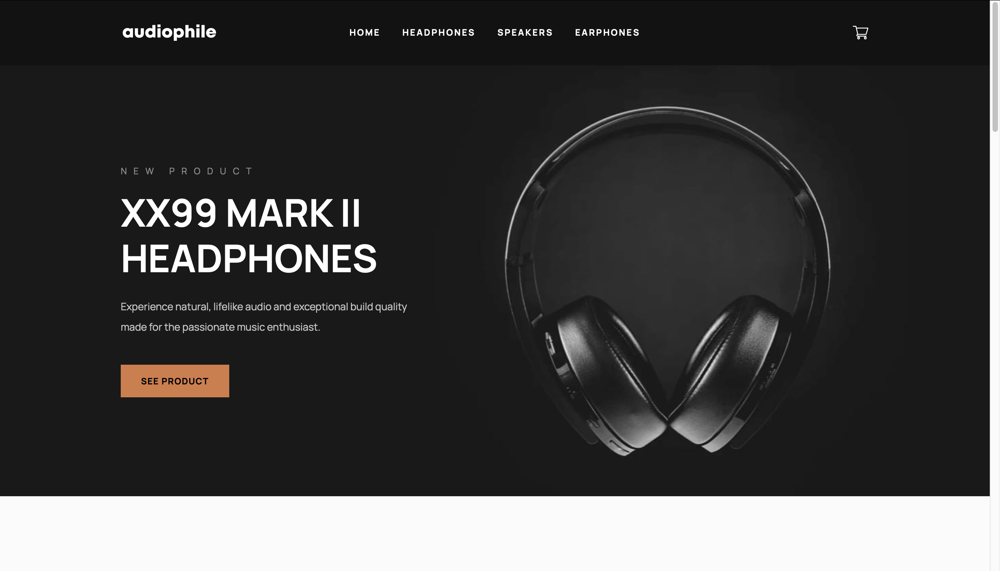

# Audiophile

This is my solution to [Frontend Mentor's Audiophile e-commerce website challenge](https://www.frontendmentor.io/challenges/audiophile-ecommerce-website-C8cuSd_wx). The motivation for this project was to use create a performant and visually engaging e-commerce experience. This app is built using React, TypeScript, React Query, React Hook Form, Bootstrap, and tested using Cypress.

## Environment Variables

To run this project, add the following environment variable:

`REACT_APP_API_URL=http://localhost:3004/api`

## Available Scripts

This project was bootstrapped with [Create React App](https://github.com/facebook/create-react-app). [JSON Server](https://github.com/typicode/json-server) provides a mock API and serves the production build.

### `yarn`

Installs dependencies.

### `yarn start`

Runs the app in the development mode at [http://localhost:3000](http://localhost:3000). Also serves the API at [http://localhost:3004](http://localhost:3004).

### `yarn test`

Launches Cypress.

### `yarn build`

Builds the app for production to the `build` folder.
