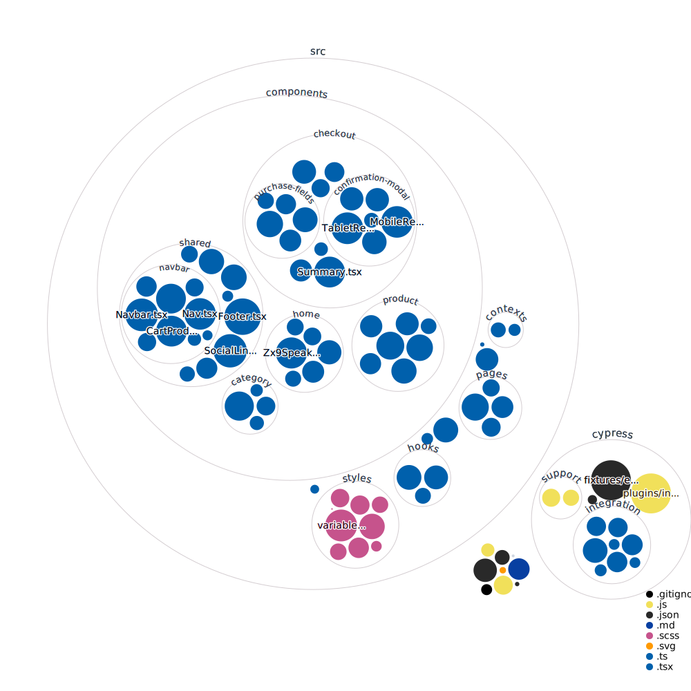

# Audiophile

This is my solution to [Frontend Mentor's Audiophile e-commerce website challenge](https://www.frontendmentor.io/challenges/audiophile-ecommerce-website-C8cuSd_wx). [View the project live](https://bruncun-audiophile.herokuapp.com).

## Codebase

## Stack

- React
- React Query
- React Router
- React Hook Form
- React Intersection Observer
- Create React App
- Craco
- TypeScript
- Bootstrap
- Sass
- Cypress
- JSON Server

## Environment Variables

To locally run this project, you'll need to add the following environment variables:

`REACT_APP_API_URL=http://localhost:3004/api`

## Available Scripts

This project was bootstrapped with [Create React App](https://github.com/facebook/create-react-app). [JSON Server](https://github.com/typicode/json-server) provides a mock API and serves the production build.

### `yarn`

Installs dependencies.

### `yarn start`

Runs the app in the development mode at [http://localhost:3000](http://localhost:3000). Also serves the API at [http://localhost:3004](http://localhost:3004).

### `yarn test`

Launches Cypress.

### `yarn build`

Builds the app for production to the `build` folder.
